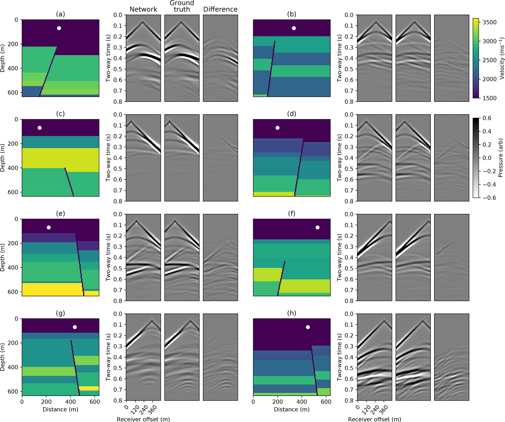
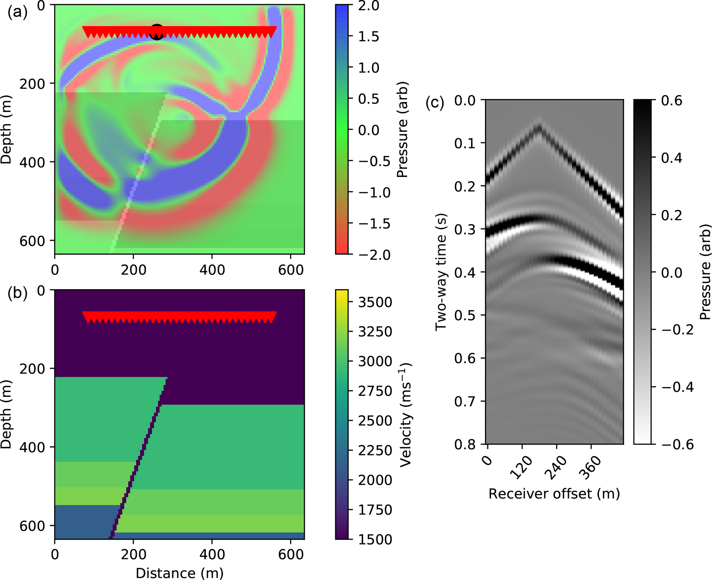
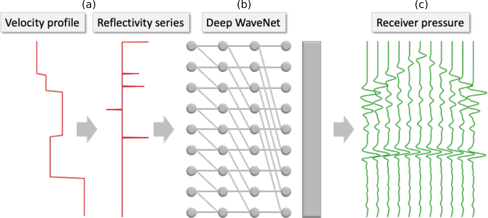
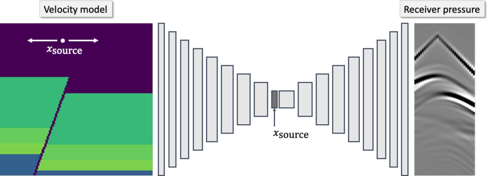

# Deep learning for fast simulation of seismic waves in complex media

---

This repository reproduces the results of the paper *[Deep learning for fast simulation of seismic waves in complex media](https://se.copernicus.org/articles/11/1527/2020/), B. Moseley, T. Nissen-Meyer and A. Markham, 2020 Solid Earth*

---



## Overview

- **Seismic simulation** is crucial for many geophysical applications, yet traditional approaches are **computationally expensive**.

- We present two **deep neural networks** which are able to simulate seismic waves in complex media.

- The first network simulates seismic waves in **horizontally layered media** and uses a **WaveNet** design. 

- The second network is significantly more general and simulates seismic waves in **faulted media** with arbitrary layers, fault properties and **an arbitrary location of the seismic source** on the surface of the media, using a **conditional autoencoder** design. 

- Both are networks are **multiple orders of magnitude faster** than traditional simulation methods.

- We discuss the **challenges** of extending deep learning approaches to **more complex, elastic and 3-D Earth models** required for practical simulation tasks.

## Goal

In this study our goal is to understand whether deep neural networks can simulate **acoustic seismic waves** in synthetic media.

To answer this question, we consider simulating the seismic response of a single fixed point source propagating through a 2D velocity model at multiple receiver locations horizontally offset from the source, shown below:



Our task is as follows:

> Given a randomly selected velocity model as input, can we train a neural network to simulate the pressure response recorded at each receiver location?

We wish the network to **generalise** well to velocity models unseen during training.

## Workflow

We design two neural networks to complete this task;

- The first network simulates the seismic response in **horizontally layered media** and uses a **WaveNet** design. The input to the network is a velocity model converted to its corresponding reflectivity series and its output is a prediction of the seismic response at 11 fixed receiver locations. It is trained using many ground truth FD simulation examples.



- The second network simulates the seismic response in **faulted media** with arbitrary layers, fault properties and **an arbitrary location of the seismic source** on the surface of the media, and uses a **conditional autoencoder** design. The input to this network is the velocity model without any preprocessing applied and its output is a prediction of the seismic response at 32 fixed receiver locations. The input source location is concatenated to the network's latent vector, and is allowed to vary along the surface of the media.



## Installation

`seismic-simulation-complex-media` requires Python (for deep learning) and Fortran (for running FD simulation using the [SEISMIC CPML library](https://github.com/geodynamics/seismic_cpml) libraries to run.

We recommend setting up a new environment, for example:

```bash
conda create -n seismicsim python=3.6  # Use Anaconda package manager
conda activate seismicsim
```
and then installing the following Python dependencies:
```bash
pip install --ignore-installed --upgrade [packageURL]# install tensorflow (get packageURL from https://www.tensorflow.org/install/pip, see tensorflow website for details)
conda install pytorch torchvision cudatoolkit=10.2 -c pytorch
conda install scipy matplotlib jupyter
pip install tensorboardX
```

All of our work was completed using **TensorFlow version 1.14.0** (for the WaveNet network) and **PyTorch version 1.5.0** (for the conditional autoencoder network).

Next, download the source code:

```bash
git clone https://github.com/benmoseley/seismic-simulation-complex-media.git
```

Finally, compile the SEISMIC CPML Fortran code using:

```bash
cd seismic-simulation-complex-media/generate_data/
make all
```

This should create an executable file called "xmodified_seismic_CPML_2D_pressure_second_order".

## Reproducing our results

The purpose of each folder in the repository is as follows:

- `generate_data` : generates the input velocity models and ground truth FD simulation data for training both networks.
- `marmousi` : parses and generates FD simulations using the Marmousi velocity model (Martin et al., 2006) for testing the generalisation ability of the conditional autoencoder network.
- `pyray` : provides code for carrying out 2D ray tracing, which is used as a benchmark for the WaveNet network.
- `wavenet` : defines and trains the WaveNet network.
- `autoencoder` : defines and trains the conditional autoencoder network.
- `shared_modules` : provides various helper Python modules.

To reproduce our workflow, run the following scripts in this order:

1. `generate_data/generate_velocity_models.py` : generates random velocity models for training and testing the networks.
2. `generate_data/generate_forward_simulations.py` : generates FD simulations using these velocity models.
3. `generate_data/preprocess_wavenet.py` : preprocesses velocity models used for training the WaveNet into their corresponding reflectivity series.
4. `generate_data/convert_to_flat_binary_wavenet.py` : converts the velocity models and FD simulations used for training the WaveNet into a flat binary file for efficient training.
5. `generate_data/convert_to_flat_binary_autoencoder.py` : converts the velocity models and FD simulations used for training the conditional autoencoder into a flat binary file for efficient training.
6. `wavenet/main.py` : trains the WaveNet (and inverse WaveNet) networks.
7. `autoencoder/main.py` : trains the conditional autoencoder networks.
8. Finally, all of the folders contain Jupyter Notebooks which will reproduce the results plots in the Solid Earth paper.

Steps 1-4 need to be re-run for each type of train and test dataset used in the paper. See the scripts saved in the subfolders `generate_data/velocity` and `generate_data/gather` for the configurations we used for each type of dataset. For steps 6-7, the `constants.py` file in `wavenet` and `autoencoder` can be used to set different network hyperparameters, see the saved files in `wavenet/server` and `autoencoder/server` for the configurations we used in the paper.


